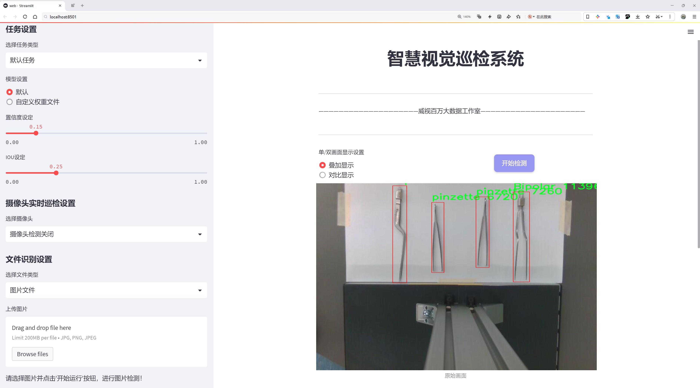
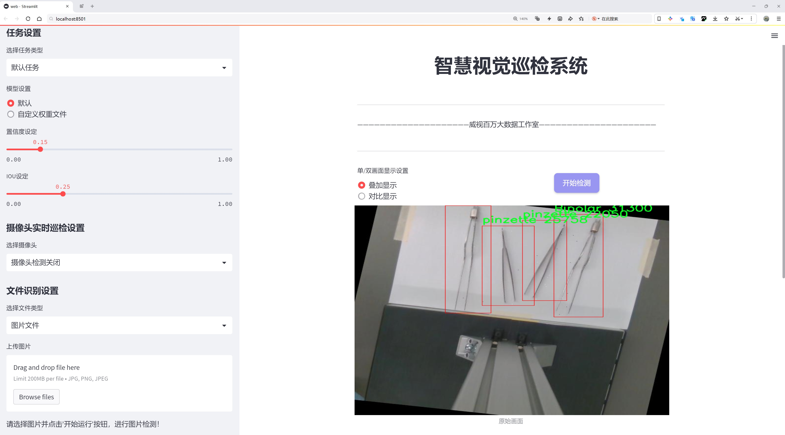
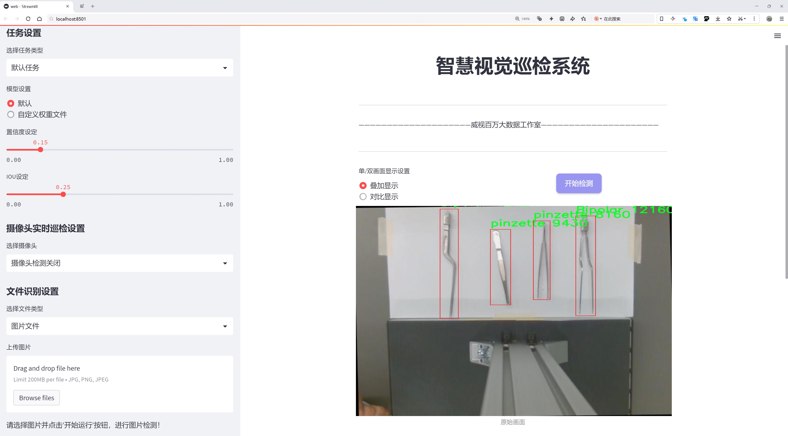
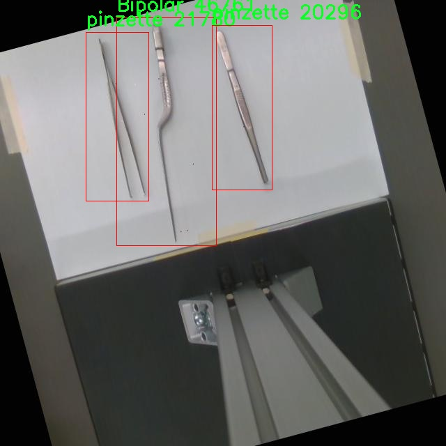
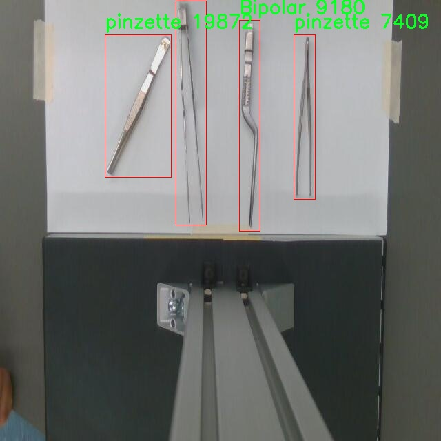
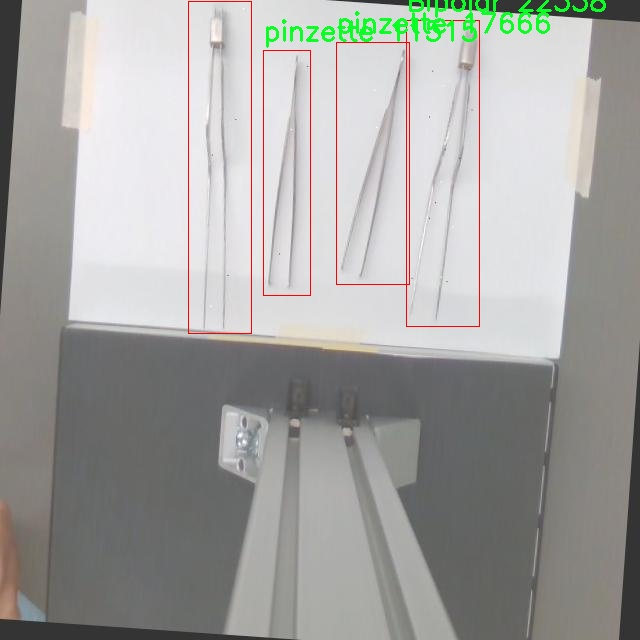
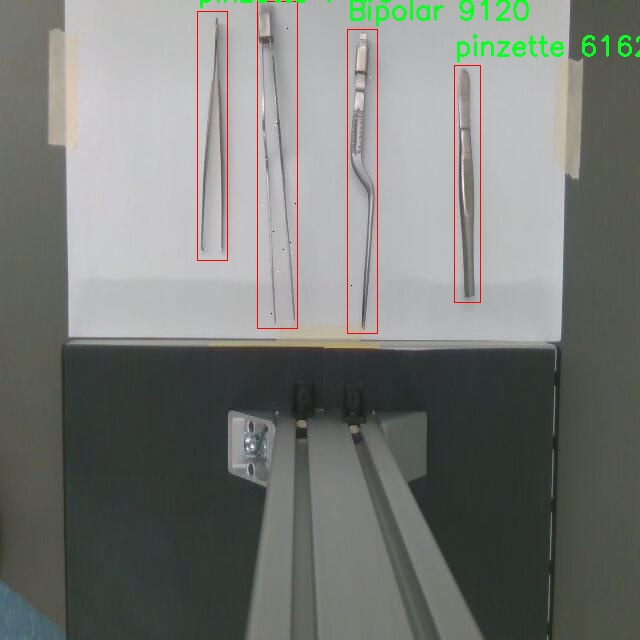
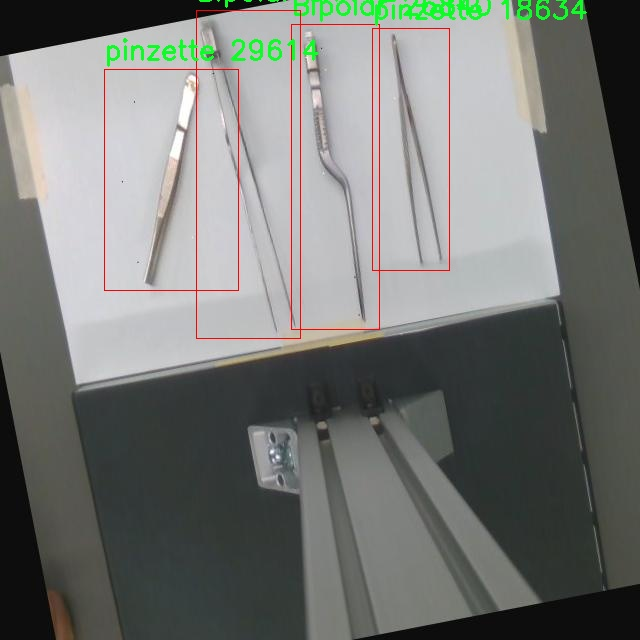

# 医疗器械检测系统源码分享
 # [一条龙教学YOLOV8标注好的数据集一键训练_70+全套改进创新点发刊_Web前端展示]

### 1.研究背景与意义

项目参考[AAAI Association for the Advancement of Artificial Intelligence](https://gitee.com/qunmasj/projects)

项目来源[AACV Association for the Advancement of Computer Vision](https://github.com/qunshansj/good)

研究背景与意义

随着医疗技术的迅速发展，医疗器械的智能化和自动化成为了提升医疗服务质量的重要方向。近年来，计算机视觉技术在医疗领域的应用逐渐受到重视，尤其是目标检测技术的进步，为医疗器械的智能识别和管理提供了新的可能性。YOLO（You Only Look Once）系列模型因其高效的实时检测能力，成为了目标检测领域的热门选择。YOLOv8作为该系列的最新版本，结合了深度学习的先进算法，展现出更强的检测精度和速度，尤其适用于医疗器械的自动识别和分类。

在医疗环境中，医疗器械的种类繁多，精确的识别和分类对于保障医疗安全、提高工作效率至关重要。传统的手动识别方法不仅耗时耗力，而且容易受到人为因素的影响，导致识别错误。基于YOLOv8的医疗器械检测系统能够通过自动化手段，快速、准确地识别医疗器械，进而为临床工作提供有力支持。通过对特定数据集的训练，该系统能够有效地识别不同类别的医疗器械，如双极器（Bipolar）和镊子（pinzette），从而实现对医疗器械的智能管理。

本研究所使用的数据集OP_KRH包含39张图像，涵盖了2个类别的医疗器械。这一数据集的规模虽然相对较小，但在特定的应用场景下，仍然具有重要的研究价值。通过对这些图像的深入分析和处理，可以探索YOLOv8在小样本数据集上的适应性和性能表现。改进YOLOv8模型的目标在于提升其在医疗器械识别中的准确性和鲁棒性，尤其是在不同光照、角度和背景下的表现。这样的研究不仅能够推动目标检测技术在医疗领域的应用，也为后续更大规模数据集的构建和模型的优化提供了基础。

此外，随着医疗器械智能化管理的需求日益增加，基于深度学习的自动识别系统将成为医疗行业的重要组成部分。通过改进YOLOv8模型，研究者可以为医疗器械的智能化管理提供更为高效的解决方案，进而提升医疗服务的质量和安全性。这一研究不仅具有理论价值，还具有广泛的实际应用前景，能够为医院、医疗机构及相关企业提供技术支持，推动医疗行业的数字化转型。

综上所述，基于改进YOLOv8的医疗器械系统的研究，不仅为医疗器械的智能识别提供了新的思路，也为深度学习技术在医疗领域的应用开辟了新的路径。通过对现有数据集的深入挖掘和模型的不断优化，未来有望实现更高效、更精准的医疗器械管理，为提升医疗服务质量做出积极贡献。

### 2.图片演示







##### 注意：由于此博客编辑较早，上面“2.图片演示”和“3.视频演示”展示的系统图片或者视频可能为老版本，新版本在老版本的基础上升级如下：（实际效果以升级的新版本为准）

  （1）适配了YOLOV8的“目标检测”模型和“实例分割”模型，通过加载相应的权重（.pt）文件即可自适应加载模型。

  （2）支持“图片识别”、“视频识别”、“摄像头实时识别”三种识别模式。

  （3）支持“图片识别”、“视频识别”、“摄像头实时识别”三种识别结果保存导出，解决手动导出（容易卡顿出现爆内存）存在的问题，识别完自动保存结果并导出到tempDir中。

  （4）支持Web前端系统中的标题、背景图等自定义修改，后面提供修改教程。

  另外本项目提供训练的数据集和训练教程,暂不提供权重文件（best.pt）,需要您按照教程进行训练后实现图片演示和Web前端界面演示的效果。

### 3.视频演示

[3.1 视频演示](https://www.bilibili.com/video/BV1FjHneuEh9/?vd_source=ff015de2d29cbe2a9cdbfa7064407a08)

### 4.数据集信息展示

##### 4.1 本项目数据集详细数据（类别数＆类别名）

nc: 2
names: ['Bipolar', 'pinzette']


##### 4.2 本项目数据集信息介绍

数据集信息展示

在本研究中，我们采用了名为“OP_KRH”的数据集，以改进YOLOv8在医疗器械系统中的应用效果。该数据集专门针对医疗器械的检测与识别，具有较高的专业性和针对性，旨在为医疗领域的自动化和智能化提供强有力的支持。数据集包含两个主要类别，分别为“Bipolar”和“pinzette”，这两种医疗器械在外科手术中具有重要的应用价值。

“Bipolar”是一种广泛应用于外科手术中的电凝器，主要用于止血和切割组织。其工作原理是通过电流产生热量，从而实现对组织的加热和凝固，减少出血风险。在手术过程中，外科医生需要精确控制其使用，以确保手术的安全性和有效性。因此，准确识别和定位“Bipolar”器械在手术视频或图像中的位置，对于提高手术的自动化水平至关重要。

另一方面，“pinzette”则是指镊子，通常用于夹持、抓取和移动小型物体。在外科手术中，镊子的使用频率极高，尤其是在微创手术中，外科医生需要通过镊子精确操作，以避免对周围组织造成损伤。因此，准确检测和识别“pinzette”同样是提升手术效率和安全性的关键。

“OP_KRH”数据集的构建过程经过精心设计，确保数据的多样性和代表性。数据集中包含了大量的图像样本，这些样本不仅涵盖了不同角度、不同光照条件下的“Bipolar”和“pinzette”，还包括了各种背景和场景。这种多样性使得模型在训练过程中能够学习到更为丰富的特征，从而在实际应用中具备更强的泛化能力。

为了提高模型的训练效果，数据集中的图像经过了精细的标注，确保每个样本中的医疗器械都被准确地框定。这种高质量的标注不仅有助于提升模型的检测精度，也为后续的模型评估提供了可靠的依据。此外，数据集还考虑到了医疗器械在不同操作环境下的表现，包含了手术室、实验室等多种场景，进一步增强了模型的适应性。

在数据集的使用过程中，我们将其分为训练集和验证集，以便于模型的训练和评估。通过不断迭代和优化，我们期望能够显著提升YOLOv8在医疗器械检测任务中的性能，进而推动医疗智能化的发展。

总之，“OP_KRH”数据集为改进YOLOv8在医疗器械系统中的应用提供了坚实的基础。通过对“Bipolar”和“pinzette”这两种关键医疗器械的深入研究与分析，我们相信该数据集将为未来的医疗技术创新提供重要的支持和参考。











### 5.全套项目环境部署视频教程（零基础手把手教学）

[5.1 环境部署教程链接（零基础手把手教学）](https://www.ixigua.com/7404473917358506534?logTag=c807d0cbc21c0ef59de5)


[5.2 安装Python虚拟环境创建和依赖库安装视频教程链接（零基础手把手教学）](https://www.ixigua.com/7404474678003106304?logTag=1f1041108cd1f708b01a)

### 6.手把手YOLOV8训练视频教程（零基础小白有手就能学会）

[6.1 环境部署教程链接（零基础手把手教学）](https://www.ixigua.com/7404477157818401292?logTag=d31a2dfd1983c9668658)

### 7.70+种全套YOLOV8创新点代码加载调参视频教程（一键加载写好的改进模型的配置文件）

[7.1 环境部署教程链接（零基础手把手教学）](https://www.ixigua.com/7404478314661806627?logTag=29066f8288e3f4eea3a4)

### 8.70+种全套YOLOV8创新点原理讲解（非科班也可以轻松写刊发刊，V10版本正在科研待更新）

由于篇幅限制，每个创新点的具体原理讲解就不一一展开，具体见下列网址中的创新点对应子项目的技术原理博客网址【Blog】：


[8.1 70+种全套YOLOV8创新点原理讲解链接](https://gitee.com/qunmasj/good)

### 9.系统功能展示（检测对象为举例，实际内容以本项目数据集为准）

图9.1.系统支持检测结果表格显示

  图9.2.系统支持置信度和IOU阈值手动调节

  图9.3.系统支持自定义加载权重文件best.pt(需要你通过步骤5中训练获得)

  图9.4.系统支持摄像头实时识别

  图9.5.系统支持图片识别

  图9.6.系统支持视频识别

  图9.7.系统支持识别结果文件自动保存

  图9.8.系统支持Excel导出检测结果数据


### 10.原始YOLOV8算法原理

原始YOLOv8算法原理

YOLOv8模型是由Ultralytics团队在YOLOv5的基础上发展而来的新一代目标检测算法，发布于2023年1月。该模型在设计上吸收了过去两年半内的多项实证改进，旨在提升目标检测的准确性和速度。YOLOv8模型不仅延续了YOLO系列一贯的高效性，还在多个方面进行了创新和优化，使其在实际应用中表现出色。

YOLOv8模型的结构主要分为三个部分：Backbone（主干网络）、Neck（颈部网络）和Head（检测头）。在Backbone部分，YOLOv8采用了一系列卷积和反卷积层，以提取图像特征。与YOLOv5相比，YOLOv8将C3模块替换为C2f模块，后者在设计上引入了YOLOv7中的ELAN（Efficient Layer Aggregation Network）思想，增加了跳层连接。这种设计不仅增强了梯度流的信息传递，还确保了模型的轻量化，提升了计算效率。C2f模块的引入使得特征提取过程更加灵活和高效，能够更好地捕捉到图像中的细节信息。

在Neck部分，YOLOv8采用了PAN-FPN（Path Aggregation Network - Feature Pyramid Network）结构，以实现多尺度特征的融合。这一设计允许模型从不同尺度的特征图中提取信息，从而更好地检测各种尺寸的目标。通过对特征图的有效融合，YOLOv8在处理复杂场景时展现出了更强的鲁棒性和准确性。

Head部分则是YOLOv8的核心，负责最终的目标检测和分类任务。与之前的YOLO版本不同，YOLOv8采用了解耦头结构，设置了两个并行的分支，分别用于提取类别和位置特征。这种结构的设计考虑到了分类和定位任务的不同侧重点，使得模型在训练和推理过程中能够更高效地进行任务分配。分类任务侧重于特征图中各类别的相似性，而定位任务则关注边界框与真实框之间的关系。通过这种解耦的方式，YOLOv8在收敛速度和预测精度上都有了显著提升。

此外，YOLOv8还引入了无锚框结构，直接预测目标的中心位置。这一创新减少了传统锚框方法带来的复杂性，使得模型在训练过程中更加高效。同时，YOLOv8采用了任务对齐学习（Task Alignment Learning，TAL）机制，以更好地区分正负样本，并通过引入分类分数和IOU（Intersection over Union）的高次幂乘积作为衡量任务对齐程度的指标，进一步提升了模型的定位和分类性能。

在数据增强方面，YOLOv8在训练过程中对Mosaic数据增强的使用进行了调整。尽管Mosaic增强有助于提升模型的鲁棒性和泛化能力，但其在一定程度上可能会破坏数据的真实分布。为此，YOLOv8在训练的最后10个epoch中停止使用Mosaic数据增强，以确保模型学习到更真实和有效的信息。

在性能方面，YOLOv8在COCO数据集上的表现令人瞩目。根据官方的数据，YOLOv8在相同尺寸下的模型参数没有显著增加的前提下，取得了比其他模型更好的精度。同时，在推理速度上，YOLOv8也展现出了更快的响应时间，确保了实时性与准确性的兼顾。这些优越的性能使得YOLOv8在实际应用中具有很大的研究和应用价值，尤其是在需要快速响应的场景，如机器人垃圾分拣系统等。

综上所述，YOLOv8模型通过对主干网络、颈部网络和检测头的多项创新和优化，提升了目标检测的效率和准确性。其引入的无锚框结构、解耦头设计以及任务对齐学习机制，标志着YOLO系列模型在目标检测领域的又一次重要进步。随着YOLOv8的推出，目标检测技术的应用前景将更加广阔，特别是在实时性和准确性要求较高的场景中，YOLOv8无疑将成为一个强有力的工具。


### 11.项目核心源码讲解（再也不用担心看不懂代码逻辑）

#### 11.1 ultralytics\models\sam\modules\tiny_encoder.py

以下是对给定代码的核心部分进行提炼和详细注释的结果。代码的主要结构和功能保留，注释旨在帮助理解每个类和方法的作用。

```python
import itertools
import torch
import torch.nn as nn
import torch.nn.functional as F
import torch.utils.checkpoint as checkpoint

class Conv2d_BN(torch.nn.Sequential):
    """执行2D卷积并随后进行批量归一化的顺序容器。"""

    def __init__(self, in_channels, out_channels, kernel_size=1, stride=1, padding=0, dilation=1, groups=1, bn_weight_init=1):
        """初始化卷积层和批量归一化层。"""
        super().__init__()
        # 添加卷积层
        self.add_module("conv", torch.nn.Conv2d(in_channels, out_channels, kernel_size, stride, padding, dilation, groups, bias=False))
        # 添加批量归一化层
        bn = torch.nn.BatchNorm2d(out_channels)
        torch.nn.init.constant_(bn.weight, bn_weight_init)  # 初始化权重
        torch.nn.init.constant_(bn.bias, 0)  # 初始化偏置
        self.add_module("bn", bn)

class PatchEmbed(nn.Module):
    """将图像嵌入为补丁并投影到指定的嵌入维度。"""

    def __init__(self, in_chans, embed_dim, resolution, activation):
        """初始化补丁嵌入层。"""
        super().__init__()
        img_size = (resolution, resolution)  # 假设输入图像为正方形
        self.patches_resolution = (img_size[0] // 4, img_size[1] // 4)  # 计算补丁分辨率
        self.seq = nn.Sequential(
            Conv2d_BN(in_chans, embed_dim // 2, kernel_size=3, stride=2, padding=1),
            activation(),
            Conv2d_BN(embed_dim // 2, embed_dim, kernel_size=3, stride=2, padding=1),
        )

    def forward(self, x):
        """通过补丁嵌入层处理输入张量。"""
        return self.seq(x)

class MBConv(nn.Module):
    """移动反向瓶颈卷积层，属于EfficientNet架构。"""

    def __init__(self, in_chans, out_chans, expand_ratio, activation):
        """初始化MBConv层。"""
        super().__init__()
        self.hidden_chans = int(in_chans * expand_ratio)  # 计算隐藏通道数

        # 定义卷积层和激活函数
        self.conv1 = Conv2d_BN(in_chans, self.hidden_chans, kernel_size=1)
        self.act1 = activation()
        self.conv2 = Conv2d_BN(self.hidden_chans, self.hidden_chans, kernel_size=3, stride=1, padding=1, groups=self.hidden_chans)
        self.act2 = activation()
        self.conv3 = Conv2d_BN(self.hidden_chans, out_chans, kernel_size=1, bn_weight_init=0.0)
        self.act3 = activation()

    def forward(self, x):
        """实现MBConv层的前向传播。"""
        shortcut = x  # 残差连接
        x = self.conv1(x)
        x = self.act1(x)
        x = self.conv2(x)
        x = self.act2(x)
        x = self.conv3(x)
        x += shortcut  # 残差连接
        return self.act3(x)

class TinyViT(nn.Module):
    """TinyViT架构，用于视觉任务。"""

    def __init__(self, img_size=224, in_chans=3, num_classes=1000, embed_dims=[96, 192, 384, 768], depths=[2, 2, 6, 2], num_heads=[3, 6, 12, 24], window_sizes=[7, 7, 14, 7], mlp_ratio=4.0):
        """初始化TinyViT模型。"""
        super().__init__()
        self.img_size = img_size
        self.num_classes = num_classes

        # 初始化补丁嵌入层
        self.patch_embed = PatchEmbed(in_chans=in_chans, embed_dim=embed_dims[0], resolution=img_size, activation=nn.GELU)

        # 构建各层
        self.layers = nn.ModuleList()
        for i_layer in range(len(depths)):
            layer = BasicLayer(dim=embed_dims[i_layer], input_resolution=(img_size // (2 ** i_layer), img_size // (2 ** i_layer)), depth=depths[i_layer], num_heads=num_heads[i_layer], window_size=window_sizes[i_layer], mlp_ratio=mlp_ratio)
            self.layers.append(layer)

        # 分类头
        self.head = nn.Linear(embed_dims[-1], num_classes) if num_classes > 0 else nn.Identity()

    def forward(self, x):
        """执行前向传播，返回模型输出。"""
        x = self.patch_embed(x)  # 处理输入图像
        for layer in self.layers:
            x = layer(x)  # 逐层处理
        return self.head(x)  # 返回分类结果
```

### 代码核心部分说明
1. **Conv2d_BN**: 该类定义了一个包含卷积和批量归一化的模块，常用于特征提取。
2. **PatchEmbed**: 该类将输入图像分割成补丁并进行嵌入，适用于Transformer模型。
3. **MBConv**: 该类实现了移动反向瓶颈卷积，主要用于高效的卷积操作。
4. **TinyViT**: 该类是TinyViT模型的核心，负责初始化模型的各个层，并实现前向传播。

这些类和方法构成了TinyViT模型的基础架构，适用于各种视觉任务。

这个文件定义了一个名为 `TinyViT` 的深度学习模型，主要用于视觉任务。模型的架构灵感来源于现有的 ViT（Vision Transformer）和 EfficientNet 等模型，结合了卷积和自注意力机制。以下是对文件中各个部分的详细解释。

首先，文件导入了一些必要的库，包括 PyTorch 的核心库和一些工具函数。接着，定义了一些基本的模块和类。

`Conv2d_BN` 类是一个简单的卷积层，后接批量归一化。它的构造函数接受多个参数，包括输入和输出通道数、卷积核大小、步幅、填充等。该类的主要作用是简化卷积和批量归一化的组合使用。

`PatchEmbed` 类负责将输入图像嵌入到小块（patches）中，并将其投影到指定的嵌入维度。它通过两个卷积层来实现，首先将输入通道数减半，然后再将其扩展到目标嵌入维度。

`MBConv` 类实现了移动反向瓶颈卷积层（Mobile Inverted Bottleneck Conv），这是 EfficientNet 架构中的一个重要组成部分。该类通过三个卷积层和激活函数来构建，每个卷积层的输出经过激活函数处理，最后与输入进行快捷连接。

`PatchMerging` 类则负责将相邻的小块合并，并将其投影到新的维度。这一过程在特征图的下采样中起到重要作用。

`ConvLayer` 类是一个包含多个 MBConv 层的卷积层，支持下采样和梯度检查点。它通过循环构建多个 MBConv 层，并在必要时进行下采样。

`Mlp` 类实现了多层感知机（MLP），用于 transformer 架构中。它包含层归一化和两个全连接层。

`Attention` 类实现了多头自注意力机制，支持空间感知。它使用可训练的注意力偏置来增强模型的表达能力。

`TinyViTBlock` 类是 TinyViT 模型的基本构建块，结合了自注意力和局部卷积。它通过窗口划分的方式处理输入，并在需要时进行填充，以适应窗口大小。

`BasicLayer` 类表示 TinyViT 架构中的一个基本层，包含多个 TinyViTBlock。它在前向传播时依次通过所有块，并在最后进行下采样（如果需要）。

`LayerNorm2d` 类实现了二维层归一化，主要用于处理特征图的归一化。

最后，`TinyViT` 类是整个模型的核心。它初始化了模型的各个部分，包括图像嵌入、多个层、分类头等。模型的构造函数接受多个参数，以便灵活配置模型的各个方面，如输入图像大小、嵌入维度、层数、注意力头数等。

模型的前向传播方法 `forward` 将输入通过各个层进行处理，最终输出特征。`forward_features` 方法则专注于特征提取，返回经过处理的特征图。

整体来看，这个文件实现了一个高效的视觉模型 TinyViT，结合了卷积和自注意力机制，适用于各种视觉任务。

#### 11.2 ultralytics\models\sam\amg.py

以下是经过简化和注释的核心代码部分：

```python
import torch
import numpy as np

def is_box_near_crop_edge(
    boxes: torch.Tensor, crop_box: List[int], orig_box: List[int], atol: float = 20.0
) -> torch.Tensor:
    """
    判断给定的边界框是否接近裁剪边缘。

    参数:
    - boxes: 需要检查的边界框，格式为 (x1, y1, x2, y2) 的张量。
    - crop_box: 当前裁剪框的边界，格式为 [x0, y0, x1, y1]。
    - orig_box: 原始图像的边界框，格式为 [x0, y0, x1, y1]。
    - atol: 允许的绝对误差，默认为 20.0。

    返回:
    - 返回一个布尔张量，指示每个框是否接近裁剪边缘。
    """
    crop_box_torch = torch.as_tensor(crop_box, dtype=torch.float, device=boxes.device)
    orig_box_torch = torch.as_tensor(orig_box, dtype=torch.float, device=boxes.device)
    
    # 将边界框从裁剪坐标系转换回原始坐标系
    boxes = uncrop_boxes_xyxy(boxes, crop_box).float()
    
    # 检查边界框是否接近裁剪框和原始图像边缘
    near_crop_edge = torch.isclose(boxes, crop_box_torch[None, :], atol=atol, rtol=0)
    near_image_edge = torch.isclose(boxes, orig_box_torch[None, :], atol=atol, rtol=0)
    
    # 只有当框接近裁剪边缘且不接近原始图像边缘时，才返回 True
    near_crop_edge = torch.logical_and(near_crop_edge, ~near_image_edge)
    return torch.any(near_crop_edge, dim=1)


def uncrop_boxes_xyxy(boxes: torch.Tensor, crop_box: List[int]) -> torch.Tensor:
    """
    将边界框从裁剪坐标系转换回原始坐标系。

    参数:
    - boxes: 需要转换的边界框，格式为 (x1, y1, x2, y2) 的张量。
    - crop_box: 当前裁剪框的边界，格式为 [x0, y0, x1, y1]。

    返回:
    - 返回转换后的边界框。
    """
    x0, y0, _, _ = crop_box
    offset = torch.tensor([[x0, y0, x0, y0]], device=boxes.device)
    
    # 检查 boxes 是否有通道维度
    if len(boxes.shape) == 3:
        offset = offset.unsqueeze(1)
    
    return boxes + offset


def calculate_stability_score(masks: torch.Tensor, mask_threshold: float, threshold_offset: float) -> torch.Tensor:
    """
    计算一批掩膜的稳定性分数。

    稳定性分数是通过对预测掩膜的 logits 进行高低阈值二值化后计算的 IoU。

    参数:
    - masks: 预测的掩膜张量。
    - mask_threshold: 掩膜的阈值。
    - threshold_offset: 阈值偏移量。

    返回:
    - 返回每个掩膜的稳定性分数。
    """
    # 计算交集和并集
    intersections = (masks > (mask_threshold + threshold_offset)).sum(-1, dtype=torch.int16).sum(-1, dtype=torch.int32)
    unions = (masks > (mask_threshold - threshold_offset)).sum(-1, dtype=torch.int16).sum(-1, dtype=torch.int32)
    
    return intersections / unions
```

### 代码说明：
1. **is_box_near_crop_edge**: 该函数用于判断给定的边界框是否接近裁剪框的边缘。它首先将边界框从裁剪坐标系转换回原始坐标系，然后检查这些框是否接近裁剪框和原始图像的边缘。

2. **uncrop_boxes_xyxy**: 该函数用于将边界框从裁剪坐标系转换回原始坐标系。它通过添加裁剪框的偏移量来实现这一点。

3. **calculate_stability_score**: 该函数计算一批掩膜的稳定性分数，使用高低阈值对掩膜进行二值化，并计算它们的交集和并集以得到 IoU。

这个程序文件 `ultralytics\models\sam\amg.py` 是一个与目标检测和图像分割相关的模块，主要用于处理图像中的边界框、掩码以及图像裁剪等操作。以下是对文件中各个部分的详细说明。

首先，文件导入了一些必要的库，包括数学运算库 `math`、迭代工具 `itertools`、类型提示库 `typing` 以及数值计算库 `numpy` 和深度学习框架 `torch`。这些库为后续的计算和数据处理提供了支持。

文件中定义了多个函数。`is_box_near_crop_edge` 函数用于判断给定的边界框是否接近裁剪边缘。它接收边界框、裁剪框和原始框作为输入，并返回一个布尔张量，指示哪些边界框接近裁剪边缘。该函数使用了 `uncrop_boxes_xyxy` 函数来将裁剪框的坐标转换为原始图像的坐标。

`batch_iterator` 函数用于生成数据的批次迭代器，确保输入的各个参数具有相同的长度，并按指定的批次大小进行分割。

`calculate_stability_score` 函数计算一组掩码的稳定性分数，稳定性分数是通过对掩码进行阈值处理后计算的交并比（IoU），用于评估掩码的质量。

`build_point_grid` 函数生成一个二维网格，网格中的点均匀分布在 [0,1] x [0,1] 的范围内。`build_all_layer_point_grids` 函数则为不同层次生成点网格，考虑到每层的缩放比例。

`generate_crop_boxes` 函数生成不同大小的裁剪框。它根据输入图像的尺寸、层数和重叠比例计算出每一层的裁剪框，并返回这些裁剪框及其对应的层索引。

`uncrop_boxes_xyxy` 和 `uncrop_points` 函数用于将裁剪框和点的坐标转换为原始图像的坐标，确保在处理过程中坐标的正确性。

`uncrop_masks` 函数则用于将掩码从裁剪区域扩展到原始图像的大小，确保掩码的完整性。

`remove_small_regions` 函数使用 OpenCV 库来移除掩码中的小区域或孔洞，返回处理后的掩码和是否进行了修改的标志。

最后，`batched_mask_to_box` 函数计算掩码周围的边界框，返回格式为 XYXY 的边界框。如果掩码为空，则返回 [0, 0, 0, 0]。

总体而言，这个文件提供了一系列用于图像处理和分析的工具，特别是在目标检测和分割任务中，帮助用户有效地处理图像数据。

#### 11.3 ui.py

```python
import sys
import subprocess

def run_script(script_path):
    """
    使用当前 Python 环境运行指定的脚本。

    Args:
        script_path (str): 要运行的脚本路径

    Returns:
        None
    """
    # 获取当前 Python 解释器的路径
    python_path = sys.executable

    # 构建运行命令，使用 streamlit 运行指定的脚本
    command = f'"{python_path}" -m streamlit run "{script_path}"'

    # 执行命令并等待其完成
    result = subprocess.run(command, shell=True)
    
    # 检查命令执行的返回码，如果不为0，表示执行出错
    if result.returncode != 0:
        print("脚本运行出错。")


# 实例化并运行应用
if __name__ == "__main__":
    # 指定要运行的脚本路径
    script_path = "web.py"  # 假设脚本在当前目录下

    # 调用函数运行脚本
    run_script(script_path)
```

### 代码核心部分及注释说明：

1. **导入模块**：
   - `import sys`: 导入 sys 模块以获取当前 Python 解释器的路径。
   - `import subprocess`: 导入 subprocess 模块以便在 Python 中执行外部命令。

2. **定义 `run_script` 函数**：
   - 该函数接受一个参数 `script_path`，表示要运行的 Python 脚本的路径。
   - 使用 `sys.executable` 获取当前 Python 解释器的路径。
   - 构建一个命令字符串，使用 `streamlit` 模块运行指定的脚本。
   - 使用 `subprocess.run` 执行命令，并等待其完成。
   - 检查命令的返回码，如果返回码不为0，表示脚本运行出错，并打印错误信息。

3. **主程序块**：
   - 在 `if __name__ == "__main__":` 块中，指定要运行的脚本路径（这里假设脚本名为 `web.py`）。
   - 调用 `run_script` 函数来执行指定的脚本。

这个程序文件名为 `ui.py`，其主要功能是使用当前的 Python 环境来运行一个指定的脚本，具体是通过 Streamlit 框架来启动一个 Web 应用。

首先，程序导入了几个必要的模块，包括 `sys`、`os` 和 `subprocess`。其中，`sys` 模块用于访问与 Python 解释器相关的变量和函数，`os` 模块提供了与操作系统交互的功能，而 `subprocess` 模块则用于执行外部命令。

接着，程序从 `QtFusion.path` 模块中导入了 `abs_path` 函数，这个函数的作用是获取文件的绝对路径。

在 `run_script` 函数中，程序接收一个参数 `script_path`，表示要运行的脚本的路径。函数首先获取当前 Python 解释器的路径，存储在 `python_path` 变量中。然后，构建一个命令字符串 `command`，这个命令会调用 Streamlit 来运行指定的脚本。具体的命令格式是 `"{python_path}" -m streamlit run "{script_path}"`，其中 `{python_path}` 和 `{script_path}` 会被实际的路径替换。

接下来，程序使用 `subprocess.run` 方法来执行这个命令，`shell=True` 参数表示在 shell 中执行命令。执行完后，程序检查命令的返回码，如果返回码不为 0，说明脚本运行出错，程序会打印出相应的错误信息。

最后，在 `if __name__ == "__main__":` 这部分，程序指定了要运行的脚本路径，这里使用了 `abs_path("web.py")` 来获取 `web.py` 的绝对路径。然后调用 `run_script` 函数来运行这个脚本。

总的来说，这个程序的主要目的是方便地启动一个基于 Streamlit 的 Web 应用，通过指定脚本路径来运行相应的 Python 脚本。

#### 11.4 ultralytics\utils\callbacks\tensorboard.py

以下是代码中最核心的部分，并附上详细的中文注释：

```python
# 导入必要的库
from ultralytics.utils import LOGGER, SETTINGS, TESTS_RUNNING, colorstr

try:
    # 尝试导入TensorBoard的SummaryWriter
    from torch.utils.tensorboard import SummaryWriter

    # 确保当前不是在运行测试
    assert not TESTS_RUNNING  
    # 确保TensorBoard集成已启用
    assert SETTINGS["tensorboard"] is True  
    WRITER = None  # 初始化TensorBoard的SummaryWriter实例

except (ImportError, AssertionError, TypeError, AttributeError):
    # 处理导入错误或断言错误
    SummaryWriter = None  # 如果导入失败，则将SummaryWriter设置为None


def _log_scalars(scalars, step=0):
    """将标量值记录到TensorBoard中。"""
    if WRITER:  # 如果WRITER存在
        for k, v in scalars.items():  # 遍历标量字典
            WRITER.add_scalar(k, v, step)  # 记录标量值


def _log_tensorboard_graph(trainer):
    """将模型图记录到TensorBoard中。"""
    try:
        import warnings
        from ultralytics.utils.torch_utils import de_parallel, torch

        imgsz = trainer.args.imgsz  # 获取输入图像大小
        imgsz = (imgsz, imgsz) if isinstance(imgsz, int) else imgsz  # 如果是整数，转换为元组
        p = next(trainer.model.parameters())  # 获取模型参数以确定设备和类型
        im = torch.zeros((1, 3, *imgsz), device=p.device, dtype=p.dtype)  # 创建一个零输入图像
        with warnings.catch_warnings():
            warnings.simplefilter("ignore", category=UserWarning)  # 忽略JIT跟踪警告
            WRITER.add_graph(torch.jit.trace(de_parallel(trainer.model), im, strict=False), [])  # 记录模型图
    except Exception as e:
        LOGGER.warning(f"WARNING ⚠️ TensorBoard图形可视化失败 {e}")  # 记录警告信息


def on_pretrain_routine_start(trainer):
    """初始化TensorBoard记录，使用SummaryWriter。"""
    if SummaryWriter:  # 如果SummaryWriter存在
        try:
            global WRITER
            WRITER = SummaryWriter(str(trainer.save_dir))  # 创建SummaryWriter实例
            prefix = colorstr("TensorBoard: ")
            LOGGER.info(f"{prefix}开始使用 'tensorboard --logdir {trainer.save_dir}'，在 http://localhost:6006/ 查看。")
        except Exception as e:
            LOGGER.warning(f"WARNING ⚠️ TensorBoard未正确初始化，未记录此运行。 {e}")  # 记录警告信息


def on_train_start(trainer):
    """记录TensorBoard图形。"""
    if WRITER:  # 如果WRITER存在
        _log_tensorboard_graph(trainer)  # 调用记录图形的函数


def on_train_epoch_end(trainer):
    """在训练周期结束时记录标量统计信息。"""
    _log_scalars(trainer.label_loss_items(trainer.tloss, prefix="train"), trainer.epoch + 1)  # 记录训练损失
    _log_scalars(trainer.lr, trainer.epoch + 1)  # 记录学习率


def on_fit_epoch_end(trainer):
    """在训练周期结束时记录周期指标。"""
    _log_scalars(trainer.metrics, trainer.epoch + 1)  # 记录指标


# 定义回调函数字典，根据SummaryWriter是否存在进行初始化
callbacks = (
    {
        "on_pretrain_routine_start": on_pretrain_routine_start,
        "on_train_start": on_train_start,
        "on_fit_epoch_end": on_fit_epoch_end,
        "on_train_epoch_end": on_train_epoch_end,
    }
    if SummaryWriter
    else {}
)
```

### 代码说明：
1. **导入模块**：首先导入了必要的模块，包括`LOGGER`、`SETTINGS`等工具类，以及`SummaryWriter`用于记录TensorBoard日志。
2. **异常处理**：通过`try-except`块来处理可能的导入错误，确保在没有TensorBoard支持的情况下不会导致程序崩溃。
3. **记录标量**：`_log_scalars`函数用于将标量数据（如损失和学习率）记录到TensorBoard。
4. **记录模型图**：`_log_tensorboard_graph`函数用于记录模型的计算图，以便在TensorBoard中可视化。
5. **训练过程中的回调**：定义了一系列回调函数，在训练的不同阶段（如开始训练、结束每个周期等）记录相应的数据到TensorBoard。
6. **回调字典**：根据`SummaryWriter`的存在与否，初始化回调函数字典，确保只有在支持TensorBoard时才会使用这些回调。

这个程序文件是用于在Ultralytics YOLO框架中集成TensorBoard的回调函数模块。TensorBoard是一个可视化工具，通常用于监控和分析机器学习模型的训练过程。代码首先导入了一些必要的模块和工具，包括日志记录器（LOGGER）、设置（SETTINGS）和颜色字符串（colorstr）。接着，它尝试从PyTorch的utils中导入SummaryWriter，这是TensorBoard的核心组件。

在导入过程中，代码中有一些断言检查，确保在运行测试时不会记录日志，并且确认TensorBoard集成是启用的。如果导入失败或断言失败，SummaryWriter将被设置为None，以避免后续调用出现错误。

接下来，定义了几个私有函数。`_log_scalars`函数用于将标量值记录到TensorBoard中。它接收一个字典类型的标量数据和一个步数参数，遍历字典并将每个标量值添加到TensorBoard中。

`_log_tensorboard_graph`函数用于将模型的计算图记录到TensorBoard。它首先获取输入图像的大小，并创建一个零张量作为输入。然后使用torch.jit.trace对模型进行跟踪，并将生成的计算图添加到TensorBoard中。如果在这个过程中发生任何异常，会记录一个警告信息。

接下来是几个回调函数，分别在不同的训练阶段被调用。`on_pretrain_routine_start`函数在预训练例程开始时被调用，用于初始化TensorBoard的记录器，并输出相关信息，提示用户如何查看TensorBoard。`on_train_start`函数在训练开始时被调用，负责记录模型的计算图。`on_train_epoch_end`函数在每个训练周期结束时被调用，记录训练损失和学习率等标量统计信息。`on_fit_epoch_end`函数在训练周期结束时被调用，记录训练的各项指标。

最后，代码构建了一个回调字典，如果SummaryWriter可用，则将之前定义的回调函数添加到字典中。这个字典可以在训练过程中被调用，以便在合适的时机执行相应的日志记录操作。整体来看，这个模块为YOLO模型的训练过程提供了一个结构化的TensorBoard日志记录机制，使得用户能够方便地监控训练进展。

#### 11.5 train.py

以下是代码中最核心的部分，并附上详细的中文注释：

```python
import os
import torch
import yaml
from ultralytics import YOLO  # 导入YOLO模型库
from QtFusion.path import abs_path  # 导入路径处理函数

# 检测是否有可用的GPU，如果有则使用GPU，否则使用CPU
device = "0" if torch.cuda.is_available() else "cpu"

if __name__ == '__main__':  # 确保该模块被直接运行时才执行以下代码
    workers = 1  # 设置数据加载的工作进程数
    batch = 2    # 设置每个批次的大小

    data_name = "data"  # 指定数据集的名称
    # 获取数据集配置文件的绝对路径
    data_path = abs_path(f'datasets/{data_name}/{data_name}.yaml', path_type='current')  
    unix_style_path = data_path.replace(os.sep, '/')  # 将路径转换为Unix风格

    # 获取数据集配置文件所在的目录路径
    directory_path = os.path.dirname(unix_style_path)
    
    # 读取YAML格式的数据集配置文件
    with open(data_path, 'r') as file:
        data = yaml.load(file, Loader=yaml.FullLoader)
    
    # 如果配置文件中有'path'项，则修改为当前目录路径
    if 'path' in data:
        data['path'] = directory_path
        # 将修改后的数据写回YAML文件
        with open(data_path, 'w') as file:
            yaml.safe_dump(data, file, sort_keys=False)

    # 加载YOLOv8模型，指定模型配置文件和任务类型
    model = YOLO(model='./ultralytics/cfg/models/v8/yolov8s.yaml', task='detect')  
    
    # 开始训练模型
    results2 = model.train(
        data=data_path,  # 指定训练数据的配置文件路径
        device=device,  # 指定使用的设备（GPU或CPU）
        workers=workers,  # 指定数据加载的工作进程数
        imgsz=640,  # 指定输入图像的大小为640x640
        epochs=100,  # 指定训练的轮数为100
        batch=batch,  # 指定每个批次的大小
        name='train_v8_' + data_name  # 指定训练任务的名称
    )
```

### 代码核心部分解释：
1. **导入必要的库**：引入了处理文件、深度学习、YAML配置文件和YOLO模型的库。
2. **设备选择**：根据是否有可用的GPU来选择计算设备。
3. **数据集配置**：通过读取YAML文件获取数据集的路径，并确保路径的正确性。
4. **模型加载**：加载YOLOv8模型的配置文件，为后续的训练做准备。
5. **模型训练**：调用`train`方法开始训练，指定了数据路径、设备、工作进程数、图像大小、训练轮数和批次大小等参数。

这个程序文件`train.py`的主要功能是使用YOLO（You Only Look Once）模型进行目标检测的训练。程序首先导入了必要的库，包括`os`、`torch`、`yaml`和`ultralytics`中的YOLO模型。接着，它会根据系统是否支持CUDA来选择使用GPU还是CPU进行训练。

在`__main__`块中，程序首先设置了一些训练参数，包括工作进程数量和批次大小。然后，定义了数据集的名称为`data`，并构建了数据集配置文件的绝对路径。这个路径是通过调用`abs_path`函数来获取的，确保可以在当前工作目录下找到数据集的YAML文件。

接下来，程序读取这个YAML文件，并将其内容加载到一个字典中。特别地，如果YAML文件中包含`path`项，程序会将其修改为数据集目录的路径，并将更新后的内容写回到YAML文件中，以确保后续训练时可以正确找到数据集。

然后，程序加载了一个预训练的YOLOv8模型，指定了模型的配置文件路径。接下来，调用`model.train()`方法开始训练模型。在这个方法中，程序传入了多个参数，包括数据配置文件的路径、设备类型、工作进程数量、输入图像的大小、训练的epoch数量以及每个批次的大小。最后，训练任务的名称被设置为`train_v8_`加上数据集的名称。

总的来说，这个程序文件实现了YOLOv8模型的训练流程，包括数据集路径的处理、模型的加载以及训练参数的设置。

#### 11.6 ultralytics\data\split_dota.py

以下是代码中最核心的部分，并附上详细的中文注释：

```python
import itertools
from glob import glob
from math import ceil
from pathlib import Path
import cv2
import numpy as np
from PIL import Image
from tqdm import tqdm
from ultralytics.data.utils import exif_size, img2label_paths

def load_yolo_dota(data_root, split="train"):
    """
    加载DOTA数据集。

    参数:
        data_root (str): 数据根目录。
        split (str): 数据集的划分，可以是'train'或'val'。

    注意:
        DOTA数据集的目录结构假设如下：
            - data_root
                - images
                    - train
                    - val
                - labels
                    - train
                    - val
    """
    assert split in ["train", "val"]
    im_dir = Path(data_root) / "images" / split
    assert im_dir.exists(), f"找不到 {im_dir}，请检查数据根目录。"
    im_files = glob(str(Path(data_root) / "images" / split / "*"))
    lb_files = img2label_paths(im_files)
    annos = []
    for im_file, lb_file in zip(im_files, lb_files):
        w, h = exif_size(Image.open(im_file))  # 获取图像的原始尺寸
        with open(lb_file) as f:
            lb = [x.split() for x in f.read().strip().splitlines() if len(x)]
            lb = np.array(lb, dtype=np.float32)  # 将标签转换为浮点数数组
        annos.append(dict(ori_size=(h, w), label=lb, filepath=im_file))  # 保存原始尺寸、标签和文件路径
    return annos

def get_windows(im_size, crop_sizes=[1024], gaps=[200], im_rate_thr=0.6, eps=0.01):
    """
    获取窗口的坐标。

    参数:
        im_size (tuple): 原始图像尺寸，(h, w)。
        crop_sizes (List(int)): 窗口的裁剪尺寸。
        gaps (List(int)): 窗口之间的间隔。
        im_rate_thr (float): 窗口面积与图像面积的阈值。
    """
    h, w = im_size
    windows = []
    for crop_size, gap in zip(crop_sizes, gaps):
        assert crop_size > gap, f"无效的裁剪尺寸和间隔对 [{crop_size} {gap}]"
        step = crop_size - gap

        xn = 1 if w <= crop_size else ceil((w - crop_size) / step + 1)
        xs = [step * i for i in range(xn)]
        if len(xs) > 1 and xs[-1] + crop_size > w:
            xs[-1] = w - crop_size

        yn = 1 if h <= crop_size else ceil((h - crop_size) / step + 1)
        ys = [step * i for i in range(yn)]
        if len(ys) > 1 and ys[-1] + crop_size > h:
            ys[-1] = h - crop_size

        start = np.array(list(itertools.product(xs, ys)), dtype=np.int64)
        stop = start + crop_size
        windows.append(np.concatenate([start, stop], axis=1))
    windows = np.concatenate(windows, axis=0)

    # 计算图像在窗口中的有效区域
    im_in_wins = windows.copy()
    im_in_wins[:, 0::2] = np.clip(im_in_wins[:, 0::2], 0, w)
    im_in_wins[:, 1::2] = np.clip(im_in_wins[:, 1::2], 0, h)
    im_areas = (im_in_wins[:, 2] - im_in_wins[:, 0]) * (im_in_wins[:, 3] - im_in_wins[:, 1])
    win_areas = (windows[:, 2] - windows[:, 0]) * (windows[:, 3] - windows[:, 1])
    im_rates = im_areas / win_areas

    # 如果没有窗口满足面积阈值，则将最大比例的窗口设为1
    if not (im_rates > im_rate_thr).any():
        max_rate = im_rates.max()
        im_rates[abs(im_rates - max_rate) < eps] = 1
    return windows[im_rates > im_rate_thr]  # 返回满足阈值的窗口

def split_images_and_labels(data_root, save_dir, split="train", crop_sizes=[1024], gaps=[200]):
    """
    分割图像和标签。

    注意:
        DOTA数据集的目录结构假设如下：
            - data_root
                - images
                    - split
                - labels
                    - split
        输出目录结构为：
            - save_dir
                - images
                    - split
                - labels
                    - split
    """
    im_dir = Path(save_dir) / "images" / split
    im_dir.mkdir(parents=True, exist_ok=True)  # 创建输出图像目录
    lb_dir = Path(save_dir) / "labels" / split
    lb_dir.mkdir(parents=True, exist_ok=True)  # 创建输出标签目录

    annos = load_yolo_dota(data_root, split=split)  # 加载数据集
    for anno in tqdm(annos, total=len(annos), desc=split):
        windows = get_windows(anno["ori_size"], crop_sizes, gaps)  # 获取窗口
        window_objs = get_window_obj(anno, windows)  # 获取每个窗口内的对象
        crop_and_save(anno, windows, window_objs, str(im_dir), str(lb_dir))  # 裁剪并保存

if __name__ == "__main__":
    split_trainval(data_root="DOTAv2", save_dir="DOTAv2-split")  # 分割训练和验证集
    split_test(data_root="DOTAv2", save_dir="DOTAv2-split")  # 分割测试集
```

### 代码核心部分说明：
1. **load_yolo_dota**: 该函数用于加载DOTA数据集的图像和标签，返回一个包含原始尺寸、标签和文件路径的字典列表。
2. **get_windows**: 该函数根据给定的图像尺寸、裁剪尺寸和间隔计算出窗口的坐标，并根据窗口面积与图像面积的比例筛选出有效窗口。
3. **split_images_and_labels**: 该函数用于分割图像和标签，调用前两个函数来实现具体的加载、窗口计算和裁剪保存操作。

这些函数是处理DOTA数据集的关键部分，能够实现数据的加载、窗口划分和图像裁剪等功能。

这个程序文件的主要功能是对DOTA（Dataset for Object Detection in Aerial Images）数据集进行图像和标签的切分处理，以便于后续的训练和验证。程序首先导入了一些必要的库，包括用于文件操作的`Path`、图像处理的`cv2`和`PIL`、以及用于数学计算的`numpy`和`itertools`。它还使用了`tqdm`库来显示进度条。

程序定义了多个函数。首先是`bbox_iof`函数，用于计算两个边界框之间的交并比（IOF），它接收一个多边形和一个边界框作为输入，返回它们的IOF值。接着是`load_yolo_dota`函数，该函数用于加载DOTA数据集的图像和标签，读取指定目录下的图像文件和对应的标签文件，并将它们的原始尺寸和标签信息存储在一个字典中。

`get_windows`函数用于生成图像的切分窗口，接收图像尺寸、切分大小和间隔等参数，返回符合条件的窗口坐标。`get_window_obj`函数则用于获取每个窗口内的对象标签，利用之前计算的IOF值来筛选出在窗口内的目标。

`crop_and_save`函数负责根据窗口坐标裁剪图像并保存，同时更新标签信息。它会将裁剪后的图像和标签保存到指定的目录中。`split_images_and_labels`函数是一个主函数，用于对图像和标签进行切分，调用前面定义的函数来处理每一张图像。

接下来的`split_trainval`和`split_test`函数分别用于切分训练集和验证集、测试集。它们会根据给定的切分大小和间隔来处理数据集，并保存到指定的输出目录。

最后，程序的主入口部分调用了`split_trainval`和`split_test`函数，指定了数据集的根目录和保存目录。整体来看，这个程序实现了对DOTA数据集的图像和标签的有效切分，方便后续的模型训练和评估。

### 12.系统整体结构（节选）

### 整体功能和构架概括

该项目是一个基于Ultralytics YOLO框架的目标检测和图像分割系统，主要功能包括模型训练、数据处理、可视化以及模型评估。项目的结构分为多个模块，每个模块负责特定的功能。主要的功能模块包括：

1. **模型定义与训练**：实现YOLO及其变种（如TinyViT、RTDETR等）的模型架构，并提供训练和评估的功能。
2. **数据处理**：包括数据集的切分、图像和标签的处理，确保数据的格式和结构适合模型训练。
3. **可视化**：集成TensorBoard等工具，用于监控训练过程和模型性能。
4. **用户界面**：提供一个简单的用户界面，方便用户运行训练脚本和查看结果。

以下是每个文件的功能整理表格：

| 文件路径                                      | 功能描述                                               |
|-----------------------------------------------|--------------------------------------------------------|
| `ultralytics/models/sam/modules/tiny_encoder.py` | 定义TinyViT模型的架构，包括卷积层、注意力机制等。     |
| `ultralytics/models/sam/amg.py`               | 提供图像处理和边界框生成的工具，支持目标检测和分割。   |
| `ui.py`                                       | 启动Streamlit Web应用，运行指定的Python脚本。         |
| `ultralytics/utils/callbacks/tensorboard.py` | 集成TensorBoard，用于记录训练过程中的指标和模型图。   |
| `train.py`                                    | 负责YOLO模型的训练流程，包括数据集加载和训练参数设置。 |
| `ultralytics/data/split_dota.py`             | 对DOTA数据集进行图像和标签的切分处理。                 |
| `ultralytics/models/rtdetr/__init__.py`      | 初始化RTDETR模型，设置模型参数和配置。                 |
| `ultralytics/solutions/object_counter.py`     | 实现目标计数功能，基于检测结果进行计数分析。           |
| `ultralytics/models/yolo/obb/val.py`         | 评估YOLO模型的性能，计算指标如mAP等。                  |
| `ultralytics/engine/results.py`               | 处理模型的预测结果，生成可视化和评估报告。             |
| `ui_style.py`                                 | 定义用户界面的样式和布局，提供视觉效果。               |
| `ultralytics/models/yolo/classify/train.py`   | 训练YOLO分类模型，处理分类任务的数据和训练流程。      |
| `ultralytics/nn/tasks.py`                     | 定义不同的任务类型（如检测、分割等），提供任务处理接口。 |

这个表格总结了每个文件的主要功能，展示了项目的模块化设计，使得各个部分可以独立开发和维护，同时又能协同工作以实现完整的目标检测和图像处理功能。

注意：由于此博客编辑较早，上面“11.项目核心源码讲解（再也不用担心看不懂代码逻辑）”中部分代码可能会优化升级，仅供参考学习，完整“训练源码”、“Web前端界面”和“70+种创新点源码”以“13.完整训练+Web前端界面+70+种创新点源码、数据集获取”的内容为准。

### 13.完整训练+Web前端界面+70+种创新点源码、数据集获取


https://mbd.pub/o/bread/ZpqZmZZp